# Velo - your Canvas co-pilot

[][live]

> Velo is a distraction-free, local-first client for the Canvas LMS that helps university students see, plan and submit their whole workload in one place.

| | |
| --- | --- |
| **Landing page** | [velo-landing-page-delta.vercel.app](https://velo-landing-page-delta.vercel.app/) |
| **Live app** | [velo-canvas-copilot.vercel.app][live] |
| **Live demo (mock data)** | [velo-canvas-copilot.vercel.app/demo][demo] - no sign-in needed, for viewers without a HAU Canvas account |
| **Demo video** | [Watch on Google Drive](https://drive.google.com/file/d/1srRAMAWLhorcxRxCmBE96qDclZ4s_ygR/view?usp=sharing) |
| **Course** | Applications Development and Emerging Technologies (6ADET), Holy Angel University |
| **Author** | Sean Rhani J. Dela Cruz |

## Contents

- [Try it](#try-it)
- [Screenshots](#screenshots)
- [What it does](#what-it-does)
- [Built with](#built-with)
- [Privacy and secrets](#privacy-and-secrets)
- [Project documentation](#project-documentation)
- [Status and what is next](#status-and-what-is-next)
- [Credits](#credits)
- [AI use](#ai-use)
- [Licence](#licence)

---

## Try it

Velo is published on the web, so there is nothing to install.

1. Open the [live app][live].
2. In Canvas, go to **Account > Settings > New Access Token** and generate a token.
3. Paste the token on Velo's sign-in screen.

The live app is connected to Holy Angel University's Canvas, so it needs a HAU Canvas account. No HAU account? Open the [live demo][demo] instead: it is the same app with sign-in skipped and every screen filled with mock data, and a banner at the top says so. Nothing in the demo is real or sent to Canvas, the AI Assistant gives sample replies, and changes reset when the page is reloaded.

On a phone, use your browser's **Add to Home Screen** to install it like an app.

## Screenshots

These were taken on a mock account with sample data.

| Log in | To do | Courses |
| :---: | :---: | :---: |
| 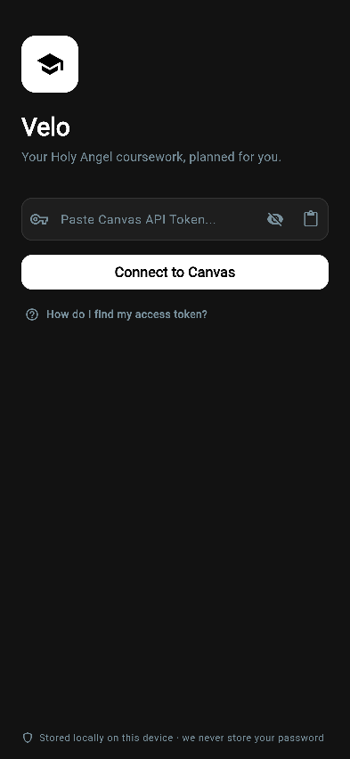 | 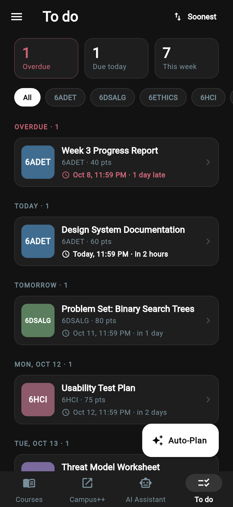 | 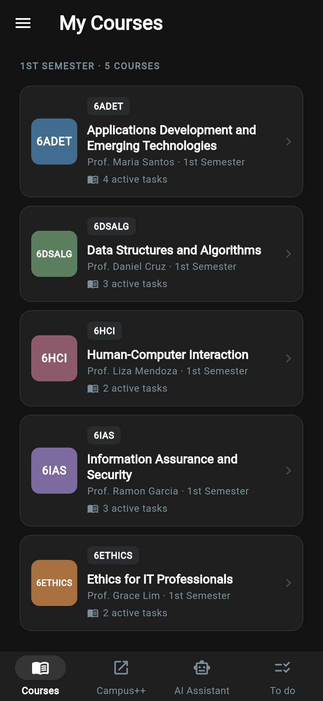 |

| ADET course | Announcements | Modules |
| :---: | :---: | :---: |
| 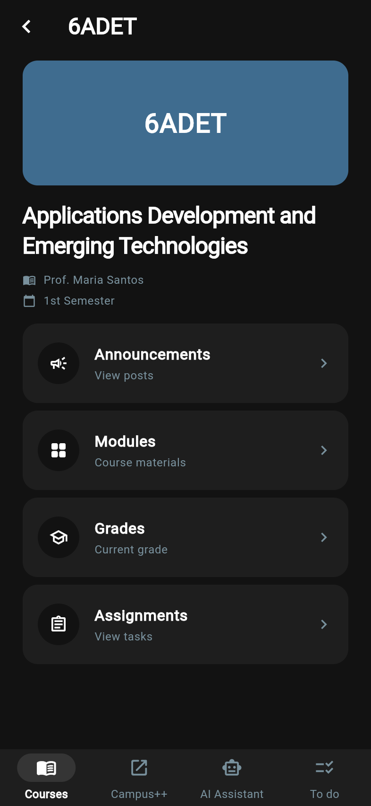 | 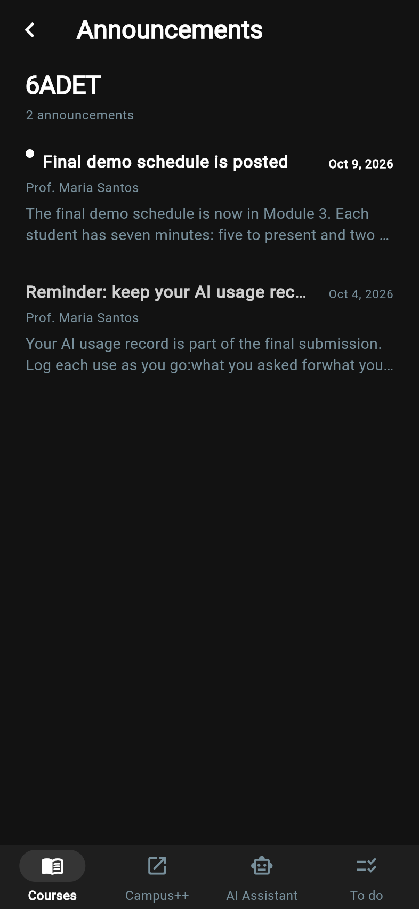 | 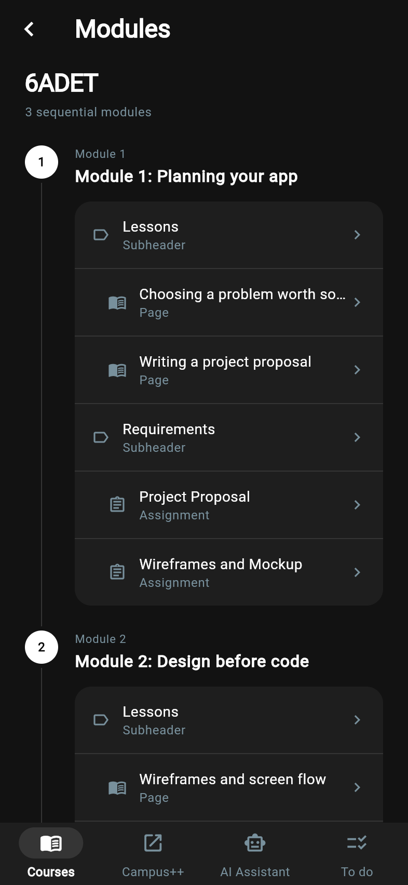 |

| Grades | Assignments | Planner |
| :---: | :---: | :---: |
| 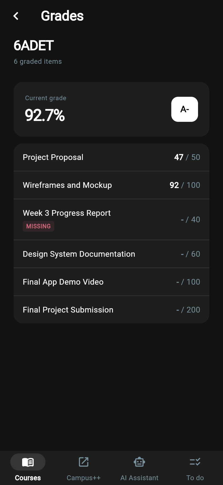 | 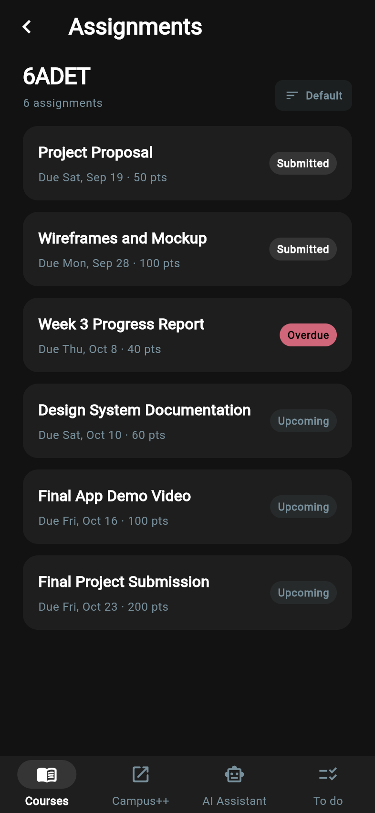 | 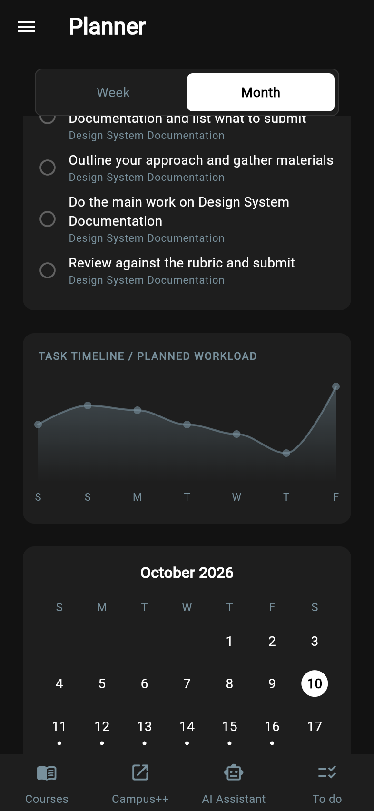 |

| AI Assistant | Inbox | Side drawer |
| :---: | :---: | :---: |
| 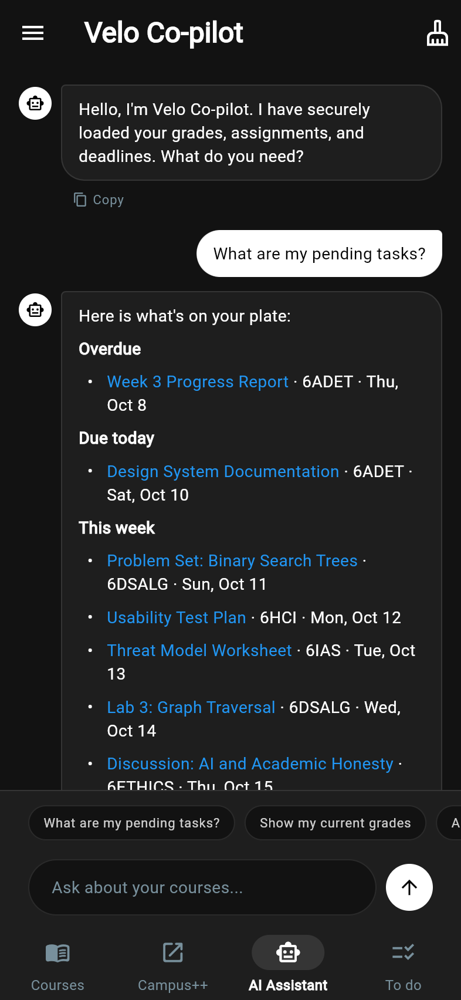 | 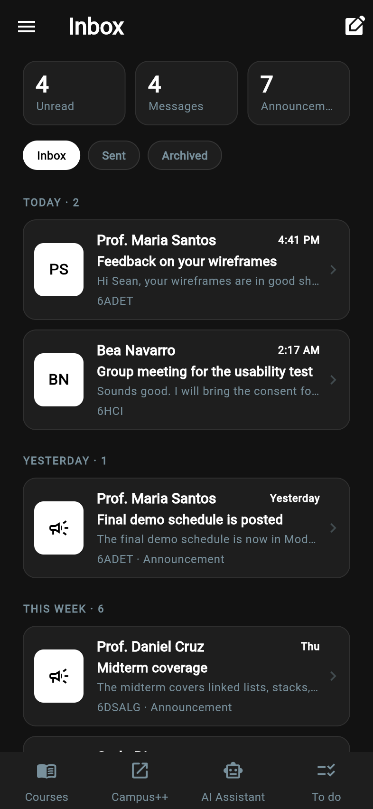 | 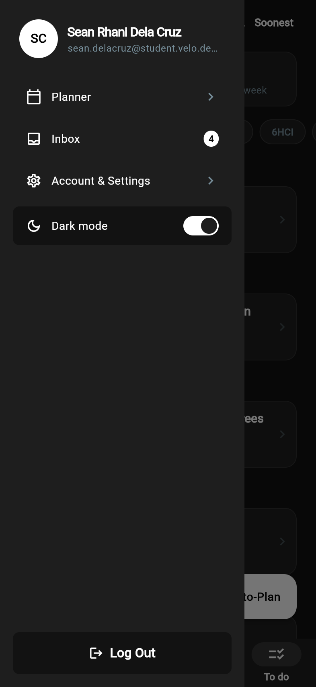 |

| Account & Settings |
| :---: |
| 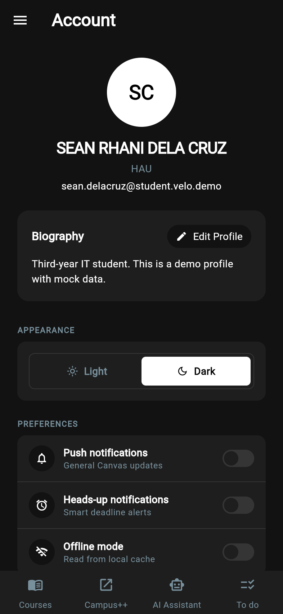 |

## What it does

| Feature | What it does |
| --- | --- |
| **Sign in** | Signs in with your own Canvas access token. The token is checked against Canvas and kept only on your device. |
| **To do** | One feed of every unsubmitted task across all your courses, sorted by deadline, with a summary of what is overdue, due today and due this week. Each card carries its course image. |
| **Courses** | Every active course with its Canvas image or colour and its count of active tasks. Each course opens to its announcements, modules, grades and assignments. |
| **Announcements** | Course announcements with their original formatting, clickable links and downloadable attachments. |
| **Modules** | The course's modules and items, with pages and assignments readable in the app and previous/next navigation. |
| **Grades** | Your current course grade and the score for each assignment, with late, missing and excused flags. |
| **Assignments and submissions** | Assignment instructions from Canvas, and real submissions as a file upload, a text entry or a website URL. The comment thread with your instructor is shown and you can post to it. |
| **Planner** | Breaks assignments into daily milestones. Auto-Plan asks the AI to spread upcoming work across the days before each deadline, and every step stays editable. |
| **AI Assistant** | A chat that answers from your real Canvas data: tasks, grades, announcements, messages and assignment details. Replies link straight to the task or thread in the app. |
| **Inbox** | Canvas conversations and course announcements together. Read, reply, compose, archive and delete, with an unread badge in the navigation. |
| **Offline mode** | Everything you have opened is cached on the device. Screens load from the cache first and refresh in the background, and offline mode shows saved data with the last sync time. |
| **Account & Settings** | Your Canvas profile and bio, light and dark themes, deadline reminders, and a shortcut to Campus++. |

## Built with

| Layer | Tools |
| --- | --- |
| Framework | Flutter (Dart), Material 3 |
| State | `provider` |
| Storage | `shared_preferences` (local-first cache and offline fallback) |
| Network | `http` |
| Backend | Canvas LMS REST API |
| AI | Groq chat completions API, with function calling |
| Routing | `go_router` |
| UI | `flutter_widget_from_html`, `flutter_markdown_plus`, `fl_chart` |
| Utilities | `file_picker`, `url_launcher`, `intl`, `timezone`, `flutter_local_notifications`, `flutter_dotenv` |
| Hosting | Vercel |

## Privacy and secrets

- **Personal data:** Velo is local-first. Your Canvas token, profile and cached course data are stored on your device with `shared_preferences`, and Velo has no database of its own. Signing out clears them.
- **What leaves the device:** requests go to Canvas, through the hosting proxy on the web build. When you use the AI Assistant or Auto-Plan, the Canvas data needed to answer (such as task names, deadlines, grades or messages) is sent to Groq.
- **Secrets:** API keys are read from a `.env` file that is not in this repository.
- **Sample data:** the app screenshots in this repository were taken in demo mode on a mock account, with made-up courses, grades and messages. They show no real Canvas data.

## Project documentation

| Document | What is in it |
| --- | --- |
| [Proposal](docs/01-proposal.md) | the problem, the users, the scope |
| [Mockup and wireframes](docs/02-mockup.md) | what it looks like, and the screen flow |
| [Design system](docs/03-design-system.md) | colors, type, spacing, components |
| [Weekly reports](docs/04-weekly-reports.md) | what happened each week |
| [Demo video](docs/05-demo-video.md) | the recording and what it shows |
| [Security and privacy](docs/06-security-and-privacy.md) | the checklist, filled in |
| [Presentation](docs/presentation/README.md) | the week 3 presentation video |
| [AI usage](AI-USAGE.md) | how AI was used, where it was wrong, and who wrote what |

| Documentation guide | What is in it |
| --- | --- |
| [Week 1](docs/documentation/01-documentation-week-1.md) | the project documentation guide for week 1 |
| [Week 2](docs/documentation/02-documentation-week-2.md) | the project documentation guide for week 2 |

## Status and what is next

**What works:**

- Sign-in with a Canvas access token, and sign-out that clears saved data.
- The To do feed, Courses, Announcements, Modules, Grades and Assignments, all on live Canvas data.
- Real assignment submissions (file, text entry, URL) and submission comments.
- The Planner with AI Auto-Plan, and the AI Assistant with function calling.
- The Inbox: read, reply, compose, archive and delete.
- Local caching, offline mode, pull to refresh, and light and dark themes.
- The web deployment, installable as a PWA.

**Known limits:**

- Sign-in uses a manually generated access token, not Canvas OAuth.
- Media-recording submissions open in Canvas; they are not sent from the app.
- A submission carries one file.
- Deadline reminders work on mobile builds, not on the web build.

**What is next:**

- Canvas OAuth sign-in in place of manual tokens.
- Media-recording and multi-file submissions.
- Notifications on the web build.

## Credits

- **Packages:** see [`pubspec.yaml`](pubspec.yaml)
- **Icons:** Flutter's Material Icons
- **Backend:** the official Canvas LMS REST API
- **AI model hosting:** Groq

## AI use

This project was built with AI assistance. Assistant used and how much: `TODO`. The full record, with a commit link for each use, the cases where the AI was wrong, and the parts written by hand, is in [AI-USAGE.md](AI-USAGE.md).

## Licence

MIT, see [LICENSE](LICENSE).

[live]: https://velo-canvas-copilot.vercel.app/
[demo]: https://velo-canvas-copilot.vercel.app/demo
