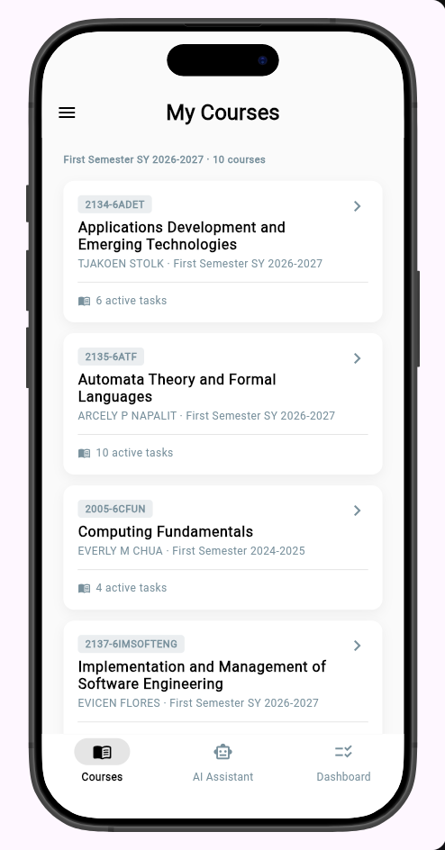
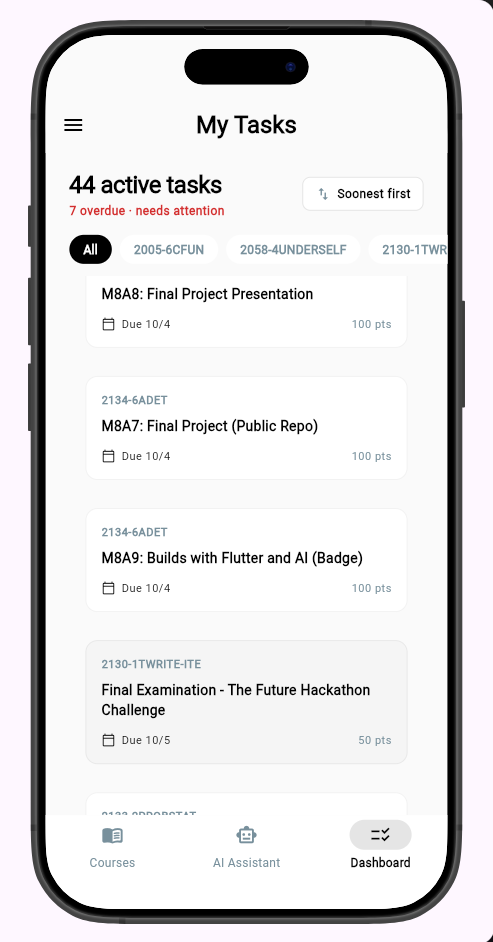
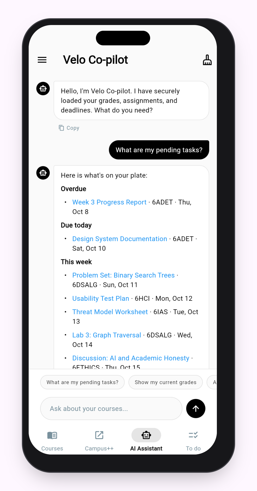
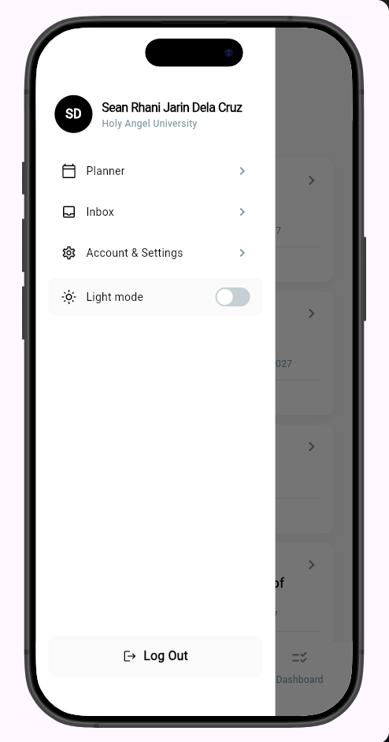
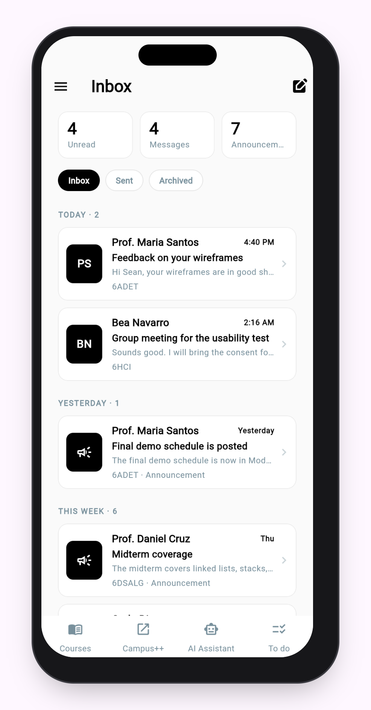
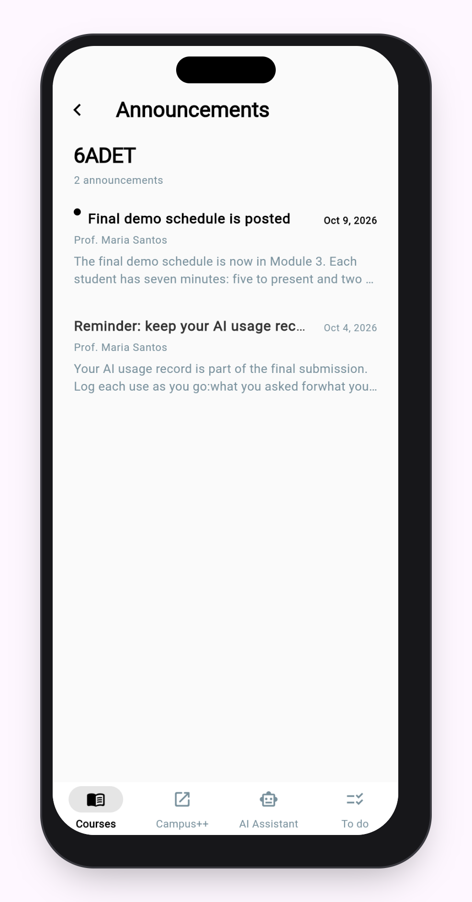
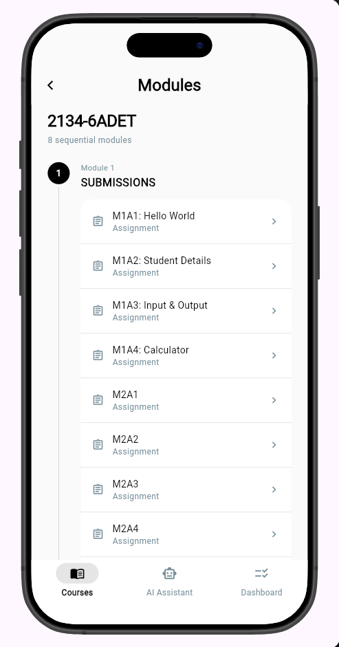
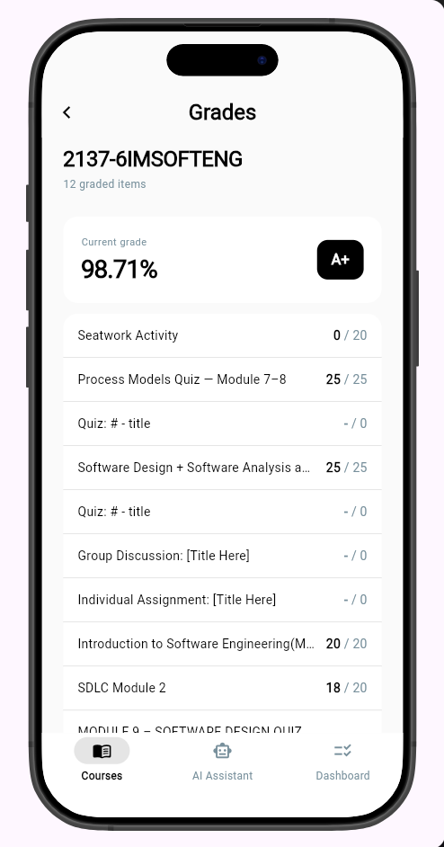
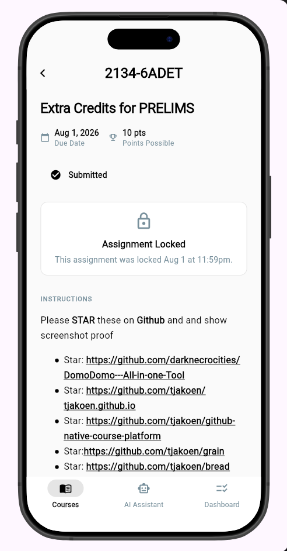

# Velo - your canvas co-pilot

> Velo is a distraction-free, local-first mobile client for the Canvas LMS designed to help university students manage heavy project workloads.

**Live demo:** PS: Will be hosting the website elsewhere (to be posted once finished)

**Demo video:** `docs/demo.mp4` (to be posted once finished)

**Course:** Applications Development and Emerging Technologies (6ADET), Holy Angel University

**Author:** Sean Rhani J. Dela Cruz

---

## Screenshots

| Courses | Dashboard | AI Assistant |
| --- | --- | --- |
|  |  |  |

| Side Drawer | Inbox | Announcements |
| --- | --- | --- |
|  |  |  |

| Modules | Grades | Assignments |
| --- | --- | --- |
|  |  |  |

## What it does

- **Secure Authentication:** Logs users in through the university's Canvas OAuth 2.0 web flow, ensuring passwords are never touched or stored.
- **Unified Master Feed & Course Hub:** Consolidates active assignments across all enrolled subjects into a single, chronologically sorted mobile feed, and provides detailed views for modules, grades, and announcements.
- **AI Assistant:** Provides a conversational interface powered by Gemini to query syllabus details, grades, and upcoming deadlines in natural language.
- **Inbox & Submissions:** Allows users to view threaded conversations, compose messages, and submit file/text assignments directly to Canvas.

## Built with

| | |
| --- | --- |
| Framework | Flutter (Dart) |
| State | `provider` |
| Storage | `shared_preferences` (local-first caching and offline fallback) |
| Network & API | `http`, `google_generative_ai` |
| UI & Routing | `go_router`, `device_preview`, `flutter_widget_from_html` |
| Utilities | `file_picker`, `intl`, `url_launcher`, `flutter_local_notifications` |

## Running it yourself

```bash
flutter pub get
cp .env.example .env
flutter run -d chrome --web-browser-flag "--disable-web-security"
```

Then open the launched Chrome instance. This command bypasses CORS restrictions during local development while testing with the live Canvas API. Requires Flutter 3.44.0 or higher.

### Environment variables

This project reads its configuration from a `.env` file that is **not** in the
repository. Copy `.env.example`, fill in your own values, and never commit the
result.

| Variable | What it is | Where to get one |
| --- | --- | --- |
| `CANVAS_BASE_URL` | Base URL for your Canvas instance | Usually `https://canvas.instructure.com` or your university's specific domain |
| `CANVAS_API_TOKEN` | Canvas LMS access token | Generated from your university Canvas portal settings |
| `GEMINI_API_KEY` | Google Gemini AI key | Google AI Studio |

## Privacy and secrets

Required section. Two or three honest sentences:

- Personal Data: Velo is a strictly local-first application. User profiles, Canvas tokens, and cached course tasks are stored entirely on the device using shared_preferences. No personal data is ever sent to a third-party database.
- Secrets: API keys live exclusively in the local .env file. The application relies on Canvas as the definitive backend, meaning data security is handled entirely by the official LMS infrastructure.
- All sample data and screenshots in this repository contain no real personal information.

## Project documentations

| Document | |
| --- | --- |
| [Proposal](docs/01-proposal.md) | the problem, the users, the scope |
| [Mockup and wireframes](docs/02-mockup.md) | what it looks like, and the screen flow |
| [Design system](docs/03-design-system.md) | colors, type, spacing, components |
| [Weekly reports](docs/04-weekly-reports.md) | what happened each week |
| [Demo video](docs/05-demo-video.md) | the recording and what it shows |
| [Security and privacy](docs/06-security-and-privacy.md) | the checklist, filled in |

| Documentation Guide | |
| --- | --- |
| [Documentation](docs/documentation/01-documentation-week-1.md) | View the project documentation guide for week 1 |
| [Documentation](docs/documentation/02-documentation-week-2.md) | View the project documentation guide for week 2 |

## Status and what is next

**What works:** The core Flutter architecture is established. The Material 3 design system is fully implemented (supporting Light and Dark modes via the Side Drawer). All core UI screens (Courses, Modules, Assignments, Grades, Announcements, Inbox, Dashboard) are built. The Canvas REST API is integrated with local offline caching, and the Gemini AI Assistant is actively hooked up.

**What is half done / Next steps:**

- The Dashboard is currently functional but being actively refined.
- Deeply integrate the AI into the app's data layer so that chat responses are accurately tailored to the user's specific courses, tasks, and deadlines.
- Build the Planner hub and wire up the AI to automatically schedule and plan tasks for the user.
- Finalize the codebase for deployment, as next week will be the deployment week.

## Credits

- Packages: see pubspec.yaml
- Icons: Flutter native Material Icons (zero-dependency approach)
- Backend: Officially supported Canvas LMS REST API

## AI use

Generative AI was utilized as a collaborative thought partner during development and for debugging strict Material 3 SDK deprecations, and configuring the global routing layout. See AI-USAGE.md for a complete breakdown of prompt engineering and model usage.

## Licence

MIT, see [LICENSE](LICENSE). Change it if you want different terms[done].
