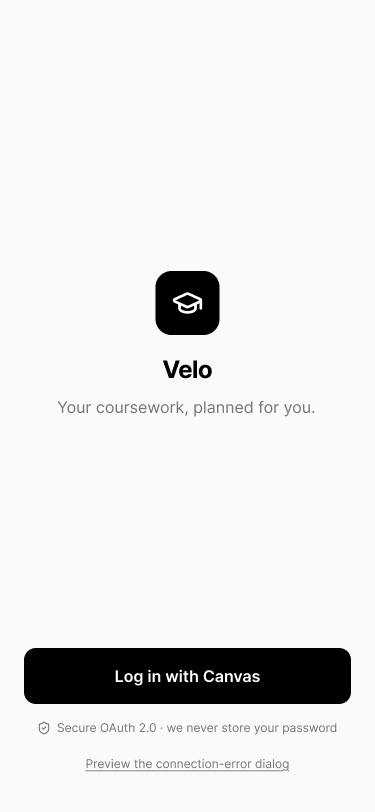
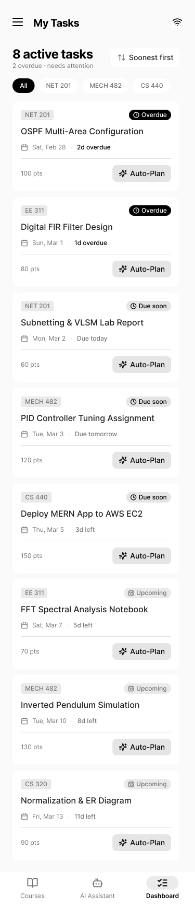
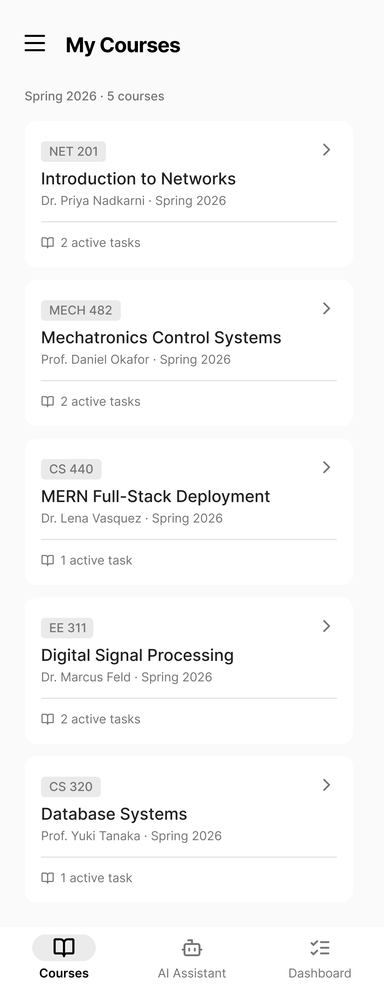
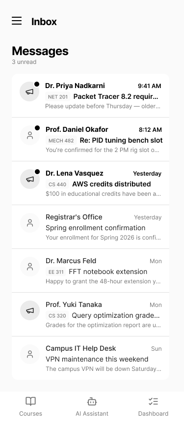
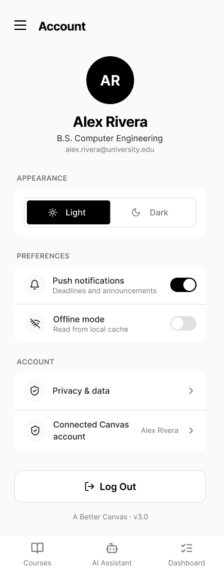

# Mockup and wireframes

The visual plan for this app. Your wireframes answered what goes where; the mockup shows what it looks like.

## Mockup

### 1. Authentication

### 2. Master Dashboard

### 3. Courses & Modules

.png)
.png)

### 4. AI Assistant

### 5. Study Planner & Inbox

### 6. Account & Settings

## Wireframes and Screen Flow

*(Ensure you export your Figma arrow flow diagram and name it `screen-flow.png` in your assets folder!)*

**High-Level Flow Mapping:**
1. **Entry Point:** Authentication Screen.
2. **Main Hub:** Master Dashboard (Unified Feed).
3. **Primary Navigation (Bottom Nav):** Users can seamlessly switch between the **Dashboard**, **AI Assistant**, and **Courses** tabs.
4. **Secondary Navigation (Side Drawer):** Accessible from the Dashboard to reach Settings, Theme toggles, Planner, Inbox, and Logout.
5. **Drill-down Flow:** From the Courses tab -> Course Details -> Specific Module -> Assignment Submission overlay.

## Screens

**1. Authentication Screen**
- **What is on it:** Minimalist branding and a single login button.
- **What the user does:** Securely inputs their Canvas API token to authenticate without storing raw passwords.
- **Where the action goes:** Tapping "Log in with Canvas" validates the token and navigates to the Master Dashboard.

**2. Master Dashboard (My Tasks)**
- **What is on it:** A unified, chronologically sorted feed of active tasks across all subjects, highlighting overdue and upcoming deadlines.
- **What the user does:** Reviews pending tasks and filters them by course urgency.
- **Where the action goes:** 
  - Filter chips filter the list view dynamically.
  - The hamburger menu opens the Side Drawer.
  - The bottom navigation switches the view to Courses or AI Assistant.

**3. Courses & Module View**
- **What is on it:** A list of enrolled courses, drill-down menus for Modules, Assignments, Grades, and Announcements, plus a submission overlay.
- **What the user does:** Browses course materials, reads announcements, and submits assignments.
- **Where the action goes:** 
  - Tapping a course card pushes the Course Details screen.
  - Tapping an assignment opens the reading details.
  - Tapping "Submit to Canvas" opens the bottom sheet file-upload/text-entry overlay.

**4. AI Assistant Tab**
- **What is on it:** A conversational chat UI powered by Gemini.
- **What the user does:** Asks natural language questions about upcoming deadlines or course materials.
- **Where the action goes:** Typing a query and hitting send adds a user bubble and triggers the API fetch to generate an AI response bubble.

**5. Side Drawer (Account, Planner, Inbox)**
- **What is on it:** Navigation to secondary features like the Calendar/Planner, Inbox, and Account settings.
- **What the user does:** Manages app-wide preferences, checks their monthly/weekly calendar, and handles session security.
- **Where the action goes:** 
  - Tapping the Theme Toggle switches the UI between Light and Dark mode.
  - Tapping "Log Out" clears `shared_preferences` and pops the user back to the Authentication screen.

## What changed, and why

| Screen or element | The wireframe assumed | The mockup shows | What I will change |
| --- | --- | --- | --- |
| **Primary Navigation** | A complex side drawer to house all navigation links. | A 3-tab Bottom Navigation bar (Courses, AI, Dashboard) with the Drawer reserved for settings. | Moved core navigation to the bottom of the screen for better thumb reachability, keeping the Side Drawer strictly for secondary account actions and the planner. |
| **Dashboard List Density** | The feed could display 5-6 assignments on the screen at once. | Only 3-4 assignment cards fit comfortably with readable typography and touch targets. | Embrace the spacious card layout and rely on scrolling and filter chips rather than cramming text. |
| **Submission Flow** | A simple submit button that directly uploads a file on a new screen. | A dedicated bottom sheet overlay for file uploads and text entry. | Built a dedicated submission overlay to handle the `file_picker` package states cleanly without disrupting the user's flow in the module. |
