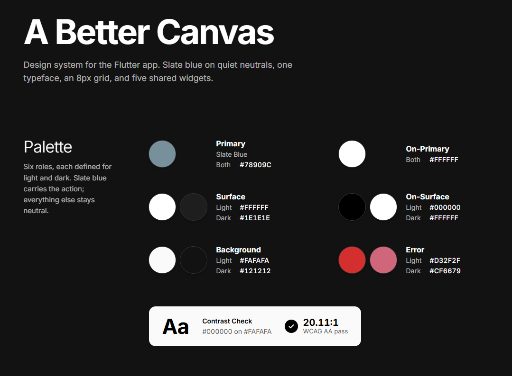
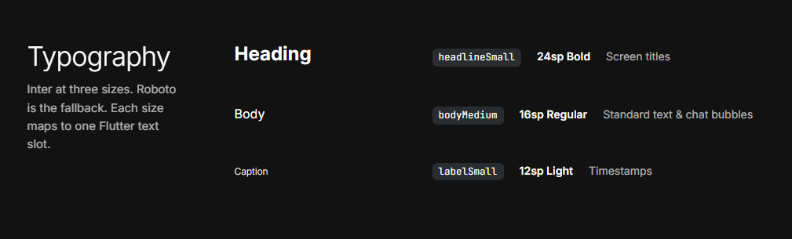
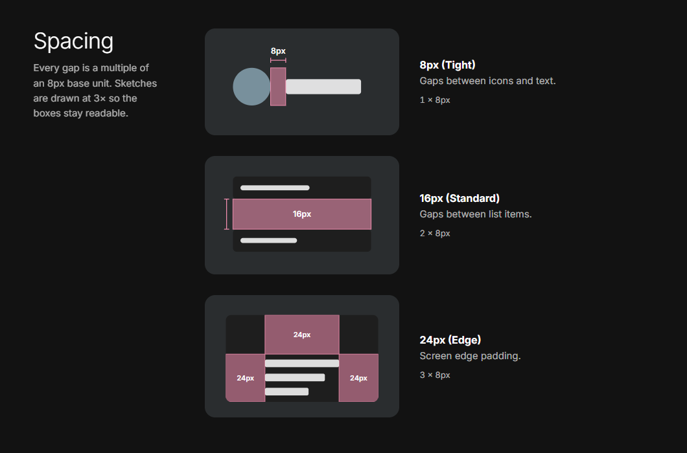
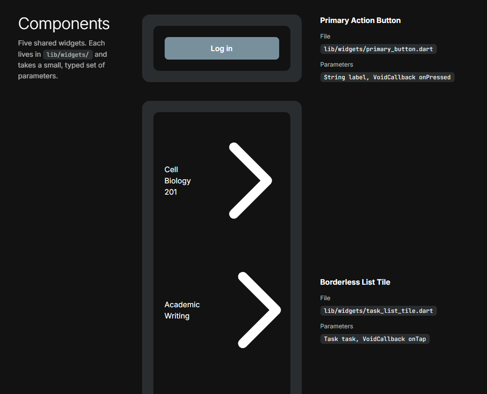
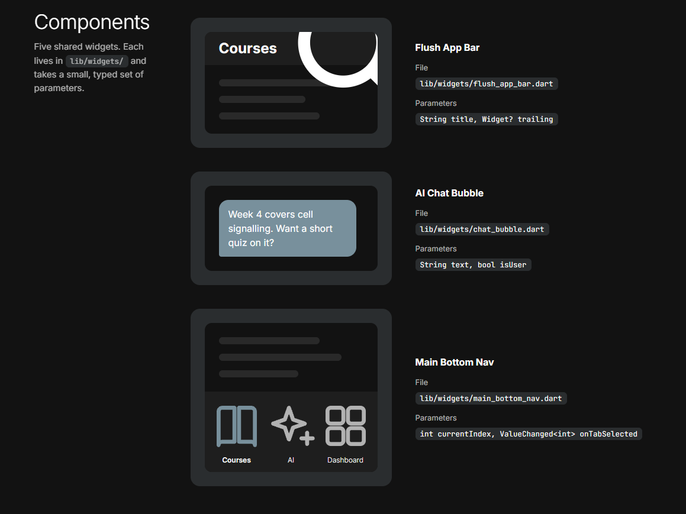

# Design system

The visual foundation and reusable components for Velo - A Better Canvas. 

 
 
 
 


*(See `assets/design-system.pdf` for the full high-resolution visual breakdown).*

## Palette

**Dark mode:** explicitly supported (Light and Dark).

Instead of generating from a single seed, the application uses a strict 5-color minimalist palette to maintain high contrast and low cognitive load. The `color-error` token has been corrected from the prelim to ensure it contrasts with the background.

```dart
// Light Theme Colors
final lightColorScheme = ColorScheme(
  brightness: Brightness.light,
  primary: const Color(0xFF78909C),     // Accent / Main Actions
  onPrimary: const Color(0xFFFFFFFF),   // Text on primary buttons
  surface: const Color(0xFFFFFFFF),     // Elevated elements / Dialogs
  onSurface: const Color(0xFF000000),   // Primary Text
  error: const Color(0xFFD32F2F),       // High-contrast red for failures
  onError: const Color(0xFFFFFFFF),     // Text on error
  background: const Color(0xFFFAFAFA),  // Universal backdrop
  onBackground: const Color(0xFF000000), 
  secondary: const Color(0xFF78909C),
  onSecondary: const Color(0xFFFFFFFF),
);

// Dark Theme Colors
final darkColorScheme = ColorScheme(
  brightness: Brightness.dark,
  primary: const Color(0xFF78909C),     // Accent / Main Actions
  onPrimary: const Color(0xFFFFFFFF),   
  surface: const Color(0xFF1E1E1E),     // Elevated elements / Dialogs
  onSurface: const Color(0xFFFFFFFF),   // Primary Text
  error: const Color(0xFFCF6679),       // Adjusted red for dark mode readability
  onError: const Color(0xFF000000),     
  background: const Color(0xFF121212),  // Universal backdrop
  onBackground: const Color(0xFFFFFFFF),
  secondary: const Color(0xFF78909C),
  onSecondary: const Color(0xFFFFFFFF),
);
```
**Contrast Check:** `onSurface` (#000000) over `background` (#FAFAFA) yields a contrast ratio of 20.11:1, easily passing the WCAG AA 4.5:1 requirement.

## Type scale

```dart
textTheme: const TextTheme(
  headlineSmall: TextStyle(fontSize: 24, fontWeight: FontWeight.bold),
  bodyMedium: TextStyle(fontSize: 16, fontWeight: FontWeight.normal),
  labelSmall: TextStyle(fontSize: 12, fontWeight: FontWeight.w300),
),
```

| Your style | Flutter slot | Size | Weight | Used for |
| --- | --- | --- | --- | --- |
| type-heading | `headlineSmall` | 24 | Bold | Screen titles, main headers, empty states |
| type-body | `bodyMedium` | 16 | Regular | Standard body text, list items, AI chat bubbles |
| type-caption | `labelSmall` | 12 | Light | Timestamps, subtle hints, metadata labels |

## Spacing

The layout is built on an 8px base unit to ensure rhythmic consistency.

```dart
class AppSpacing {
  static const double tight = 8.0;
  static const double standard = 16.0;
  static const double edge = 24.0;
}
```

- **Base unit:** 8px
- **Screen edge padding:** `AppSpacing.edge` (24px)
- **Gap between related items (icon/text):** `AppSpacing.tight` (8px)
- **Gap between sections/lists:** `AppSpacing.standard` (16px)

## Components

| Component | File | Constructor parameters | Appears on |
| --- | --- | --- | --- |
| **Primary Action Button** | `lib/widgets/primary_button.dart` | `final String label`, `final VoidCallback onPressed` | Authentication Screen, Submission Overlay |
| **Borderless List Tile** | `lib/widgets/task_list_tile.dart` | `final Task task`, `final VoidCallback onTap` | Dashboard, Course Details |
| **Flush App Bar** | `lib/widgets/flush_app_bar.dart` | `final String title`, `final Widget? trailing` | Dashboard, Courses, AI Assistant |
| **AI Chat Bubble** | `lib/widgets/chat_bubble.dart` | `final String text`, `final bool isUser` | AI Assistant Tab |
| **Main Bottom Nav** | `lib/widgets/main_bottom_nav.dart` | `final int currentIndex`, `final ValueChanged<int> onTabSelected` | Dashboard, Courses, AI Assistant |

## Changes since the last version

| Element | Prelim said | Now says | Why it changed |
| --- | --- | --- | --- |
| `color-error` Hex Code | `#FAFAFA` (Light) / `#121212` (Dark) | `#D32F2F` (Light) / `#CF6679` (Dark) | Instructor feedback pointed out an internal contradiction: the original hex codes mapped exactly to the background colors instead of a high-contrast red. |
| Reusable Components | General descriptions only | Mapped to specific screens, file paths, and constructor parameters | Instructor feedback noted that the components didn't specify which screens they appeared on. Mapped them to actual Flutter state management requirements. |
| Palette Format | Conceptual list of roles | Complete Flutter `ColorScheme` mapping | Updated to an implementation-ready format that explicitly handles both Light and Dark mode toggling. |
