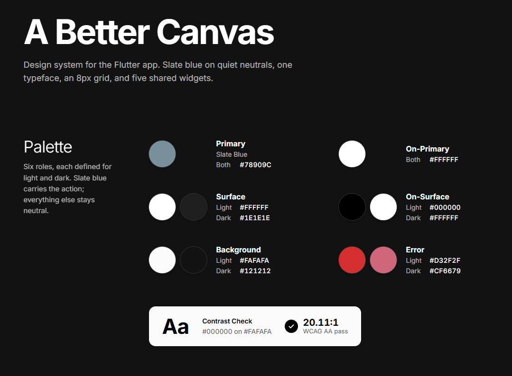
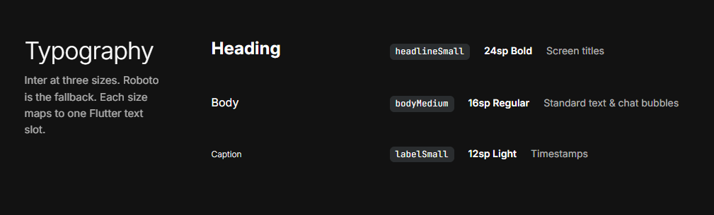
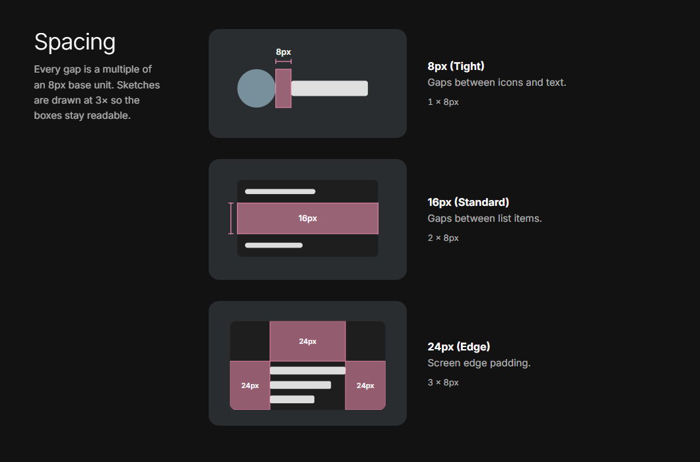
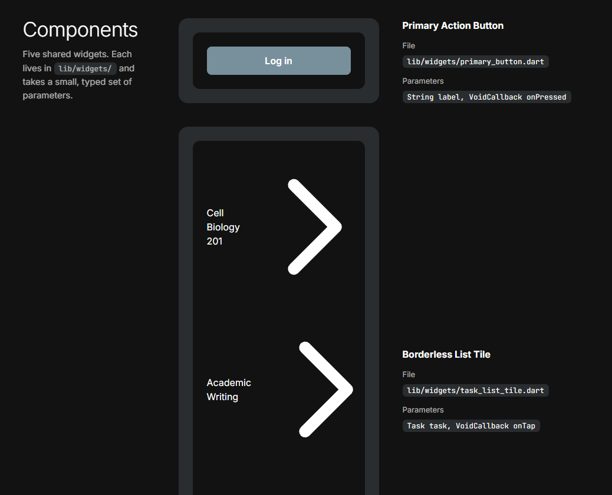
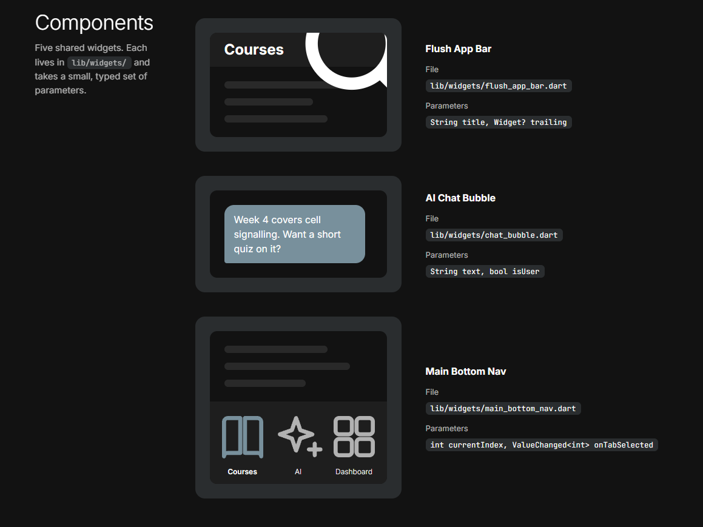

# Design system

The visual foundation and reusable components for Velo - Your Canvas Co-pilot. 

 
 
 
 


*(See `assets/design-system.pdf` for the full high-resolution visual breakdown).*

## Palette

**Dark mode:** explicitly supported (Light and Dark), switched from the side drawer and remembered on the device.

Instead of generating from a single seed, the application uses a strict 5-color minimalist palette to maintain high contrast and low cognitive load. The primary color is strictly Black/White, while the original slate gray acts as the secondary accent. The app bar takes the scaffold color and has no elevation, so it sits flush with the page.

```dart
// Core Design System Theme Configuration (lib/theme/app_theme.dart)
class AppTheme {
  static const _accent = Color(0xFF78909C);
  
  static ThemeData get light {
    return ThemeData(
      useMaterial3: true,
      brightness: Brightness.light,
      colorScheme: const ColorScheme.light(
        primary: Colors.black,        // High-contrast primary actions
        onPrimary: Colors.white,      // Text on primary buttons
        surface: Colors.white,        // Cards, sheets and dialogs
        onSurface: Colors.black,      // Primary Text
        error: Color(0xFFD32F2F),     // High-contrast red for failures and overdue
        onError: Colors.white,        // Text on error
        secondary: _accent,           // Slate gray for secondary elements
      ),
      scaffoldBackgroundColor: const Color(0xFFFAFAFA), // Universal backdrop
      fontFamily: 'Inter',
      appBarTheme: const AppBarTheme(
        backgroundColor: Color(0xFFFAFAFA),
        elevation: 0,
        scrolledUnderElevation: 0,
        iconTheme: IconThemeData(color: Colors.black),
        titleTextStyle: TextStyle(color: Colors.black, fontSize: 24, fontWeight: FontWeight.bold),
      ),
    );
  }

  static ThemeData get dark {
    return ThemeData(
      useMaterial3: true,
      brightness: Brightness.dark,
      colorScheme: const ColorScheme.dark(
        primary: Colors.white,        // High-contrast primary actions
        onPrimary: Colors.black,      
        surface: Color(0xFF1E1E1E),   // Cards, sheets and dialogs
        onSurface: Colors.white,      // Primary Text
        error: Color(0xFFCF6679),     // Adjusted red for dark mode readability
        onError: Colors.black,        
        secondary: _accent,           // Slate gray for secondary elements
      ),
      scaffoldBackgroundColor: const Color(0xFF121212), // Universal backdrop
      fontFamily: 'Inter',
      appBarTheme: const AppBarTheme(
        backgroundColor: Color(0xFF121212),
        elevation: 0,
        scrolledUnderElevation: 0,
        iconTheme: IconThemeData(color: Colors.white),
        titleTextStyle: TextStyle(color: Colors.white, fontSize: 24, fontWeight: FontWeight.bold),
      ),
    );
  }
}
```

**Status colors.** A task's urgency reuses the palette instead of adding new colors: overdue is `error`, due today is `primary`, and upcoming is `secondary`.

**Course colors.** The one place color is allowed outside the palette is a course's identity. A course shows its Canvas image; without one it shows a tile in the color the student set for it in Canvas, and courses with neither get one of eight muted fallbacks picked from the course id, so the same course always looks the same.

```dart
// lib/components/course_image.dart
const List<Color> _fallbackColors = [
  Color(0xFF3F6C8F), Color(0xFF5B7F5E), Color(0xFF8C5A6B), Color(0xFF7A6A9E),
  Color(0xFFA9703F), Color(0xFF4F8A8B), Color(0xFF9A5B4A), Color(0xFF5D6B8A),
];
```

## Type scale

The theme sets the font family and the app bar title, and every other text style comes from the Material 3 default type scale through `Theme.of(context).textTheme`, adjusted in place with `copyWith` where a weight or color needs to change.

```dart
fontFamily: 'Inter',
appBarTheme: const AppBarTheme(
  titleTextStyle: TextStyle(fontSize: 24, fontWeight: FontWeight.bold),
),
```

| Your style | Flutter slot | Size | Weight | Used for |
| --- | --- | --- | --- | --- |
| type-screen-title | `appBarTheme.titleTextStyle` | 24 | Bold | The title in the app bar of every screen |
| type-heading | `headlineSmall` | 24 | Regular | Large headers, empty states |
| type-title | `titleLarge` | 22 | Regular | Sheet and dialog titles |
| type-subtitle | `titleMedium` | 16 | Medium | Card titles, section headers, list item titles |
| type-body | `bodyMedium` | 14 | Regular | Standard body text, list items, AI chat bubbles |
| type-secondary | `bodySmall` | 12 | Regular | Supporting lines under a title, due dates, course codes |
| type-caption | `labelSmall` | 11 | Medium | Timestamps, badges, subtle hints, metadata labels |

## Spacing

The layout is built on an 8px base unit to ensure rhythmic consistency. The values are written directly in each widget's padding rather than through a constants class.

```dart
// Screen edge
padding: const EdgeInsets.symmetric(horizontal: 24),
// Inside a card
padding: const EdgeInsets.all(16),
// Between an icon and its label
const SizedBox(width: 8),
```

- **Base unit:** 8px
- **Screen edge padding:** 24px
- **Padding inside cards and sheets:** 16px
- **Gap between related items (icon/text):** 8px
- **Gap between sections/lists:** 16px
- **Corner radius:** 12px for cards, tiles and course images; 8px for small chips and inputs; 16px for bottom sheets and large containers
- **Layout breakpoint:** 800px. Below it the app uses the bottom bar and a slide-in drawer; at or above it the side drawer is pinned open.

## Components

| Component | File | Constructor parameters | Appears on |
| --- | --- | --- | --- |
| **App Shell** | `lib/components/app_shell.dart` | `final String title`, `final String activeTab`, `final Widget child`, `final List<Widget>? actions`, `final Widget? leading` | To do, Courses, AI Assistant, Planner, Inbox, Account & Settings |
| **Bottom Nav** | `lib/components/bottom_nav.dart` | `final String activeTab` | App Shell (mobile width) |
| **Side Drawer** | `lib/components/side_drawer.dart` | `final String? activeTab`, `final bool isDesktop`, `final String? desktopTitle` | App Shell (slide-in on mobile, pinned on desktop) |
| **Task Card** | `lib/components/task_card.dart` | `final Task task`, `final VoidCallback onTap` | To do, Course Assignments |
| **Course Image** | `lib/components/course_image.dart` | `final Course course`, `final double? width`, `final double height`, `final double radius` | Courses, Course Details, Task Card |
| **AI Chat Bubble** | `lib/components/chat_bubble.dart` | `final String text`, `final bool isUser`, `final void Function(String)? onLinkTap` | AI Assistant |
| **Submission Sheet** | `lib/components/submission_sheet.dart` | `showSubmissionSheet(context, courseId, assignment, resubmitting)` | Assignment Details |
| **Submission Comments** | `lib/components/submission_comments.dart` | `final List<dynamic> comments`, `final String? ownUserId`, `final Future<void> Function(String text) onSend` | Assignment Details |
| **Today's Focus Card** | `lib/components/planner/todays_focus_card.dart` | `final List<FocusStep> steps`, `final List<Task> dueSoon`, `final void Function(FocusStep step) onToggle`, `final void Function(String taskId) onOpenPlan` | Planner |
| **Day Sheet** | `lib/components/planner/day_sheet.dart` | `showDaySheet(context, date, tasks, steps, onTaskTap)` | Planner |
| **Milestone Editor Sheet** | `lib/components/planner/milestone_editor_sheet.dart` | `showMilestoneEditor(context, milestone, firstDate, lastDate)` | Planner |
| **Offline Banner** | `lib/components/offline_banner.dart` | none | App Shell (while offline mode is on) |
| **Reconnect Prompt** | `lib/components/reconnect_prompt.dart` | `final GlobalKey<NavigatorState> navigatorKey`, `final Widget child` | Global (wraps the router) |
| **Error Dialog** | `lib/components/error_dialog.dart` | `final String title`, `final String message`, `final VoidCallback onDismiss` | Login Screen, Global API Error Handling |

## Changes since the last version

| Element | Prelim said | Now says | Why it changed |
| --- | --- | --- | --- |
| Type Scale | A custom `textTheme` with three styles (`headlineSmall` 24, `bodyMedium` 16, `labelSmall` 12) | The Material 3 default type scale with `Inter` as the family, plus a 24 Bold app bar title | The finished screens needed more levels than three (card titles, supporting lines, sheet titles), and the Material 3 defaults already provide them consistently. |
| Body Text Size | `bodyMedium` at 16 | `bodyMedium` at 14 | Task cards, chat bubbles and lists carry more information than the mockups did, and 14 keeps them readable without crowding a phone screen. |
| Spacing Constants | An `AppSpacing` class (`tight`, `standard`, `edge`) | The same 8 / 16 / 24 values written inline | The class was never needed in practice; the values stayed the same, so the 8px rhythm is unchanged. |
| App Bar | Not specified | Scaffold-colored, no elevation, 24 Bold title | Keeps the app bar flush with the page in both themes, including while content scrolls under it. |
| Course Colors | Not part of the palette | Canvas course image, then the Canvas course color, then one of eight muted fallbacks | Courses were hard to tell apart in a strictly black-and-white list, so color is used for course identity only. |
| Borderless List Tile | `lib/components/task_list_tile.dart` | `Task Card` in `lib/components/task_card.dart`, with the course image, due label and points | The To do feed was redesigned around cards that show which course a task belongs to at a glance. |
| Navigation | Bottom Nav with Dashboard, AI Assistant and Courses | Bottom Nav with Courses, Campus++, AI Assistant and To do, plus a Side Drawer that is pinned open at 800px and wider | The Planner, Inbox and Account screens needed a home, and the web build is opened on tablets and desktops as well as phones. |
| Reusable Components | Five components | Fourteen components, adding the Side Drawer, Course Image, submission, planner, offline and reconnect components | Added as real submissions, the Planner and offline mode were built. |
| Material 3 Backgrounds | Used `background` and `onBackground` in `ColorScheme` | Removed deprecated tokens; relies on `scaffoldBackgroundColor` | Flutter 3.18+ deprecated `background` properties in favor of unified `surface` mapping to avoid linter warnings and precision loss. |
| Primary Action Color | `#78909C` (Slate) | `Colors.black` (Light) / `Colors.white` (Dark) | Adjusted to perfectly match the high-fidelity Figma mockups, ensuring maximum contrast. Slate gray was shifted to the `secondary` token. |
| `color-error` Hex Code | `#FAFAFA` (Light) / `#121212` (Dark) | `#D32F2F` (Light) / `#CF6679` (Dark) | Instructor feedback pointed out an internal contradiction: the original hex codes mapped exactly to the background colors instead of a high-contrast red. |
